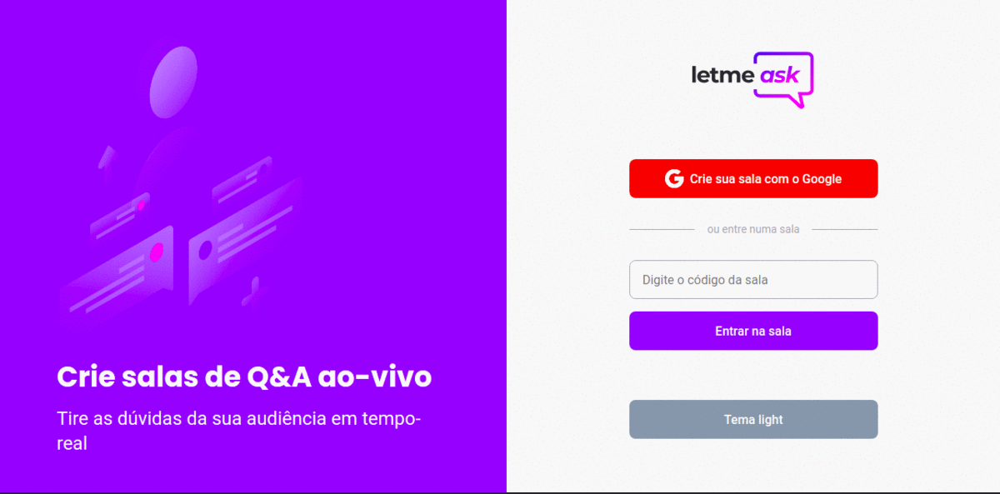

<div align="center">
    
    <br/>
</div>

# :question: Letmeask v1.0
Letmeask é perfeito para criadores de conteúdos poderem criar salas de Q&A com o seu público, de uma forma muito organizada e democrática. 

Este é um projeto desenvolvido durante a **[Next Level Week Together](https://nextlevelweek.com/)**, apresentada dos dias 20 a 27 de Junho de 2021.

### :computer: Tecnologias

Este projeto foi desenvolvido com as seguintes tecnologias:

-  [React](https://pt-br.reactjs.org/)
-  [Typescript](https://www.typescriptlang.org/)
-  [Firebase](https://firebase.google.com/?hl=pt)
-  [VS Code](https://code.visualstudio.com/)

### :arrow_forward: Em Execução:

<p align="center">
 
</p>

### :information_source: Como usar:

Para clonar e executar este aplicativo, você precisará do Git instalado em seu computador. Na linha de comando:

```bash
# Clonar este repositório
$ git clone https://github.com/DiegoTeixeira7/letmeask.git

# Vá para o repositório
$ cd letmeask

# Instale as dependências
$ sudo apt-get update
$ yarn install | npm install

# Execute o projeto
$ yarn start   | npm start
```

## 📝 License

Esse projeto está sob a licença MIT. Veja o arquivo [LICENSE](LICENSE) para mais detalhes.
